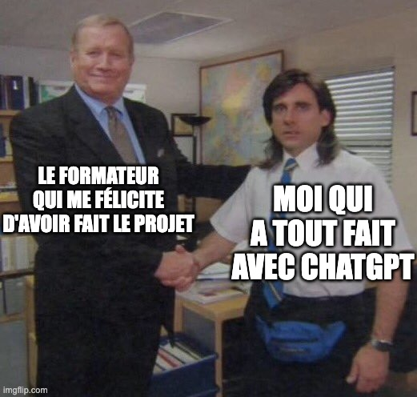

# Mission Impossible : Opération SNKRS

Bonjour agent du web,

Votre mission, si vous l'acceptez, est de reproduire une maquette en HTML et CSS. C'est une tâche de la
plus haute importance, et nous avons confiance en vos compétences pour mener à bien cette mission. De plus, une mission
ne se passe jamais comme prévu, attendez-vous à des changements de dernière minute.

### Resources utiles

- [Nucleus UI](https://icon.nucleus-ui.com/) : icônes
- [SVGL](https://svgl.vercel.app/) : icônes
- [Unsplash](https://unsplash.com/fr) : images libres de droit

## Étape 1 : Test your might

Votre première tâche est de reproduire la maquette en HTML et CSS. Nous savons que vous êtes un expert en la matière,
donc, nous ne vous donnerons pas de détails sur comment le faire. Cependant, n'oubliez pas, un bon agent est toujours
attentif aux détails. Chaque détail compte !

## Étape 2 : Start from the bottom...

Une fois la maquette reproduite, votre deuxième tâche est d'ajouter un bouton de retour en haut de la page. Ce bouton
doit être discret, mais efficace, permettant aux utilisateurs de revenir en haut de la page lorsqu'ils cliquent dessus.

## Étape 3 : Bravo Six, going dark !

Votre troisième tâche est de créer un Dark Mode. En effet, afin de gagner en discretion et en efficacité, nous avons
vraiment besoin de cette fonctionnalité. Pour cela, vous devrez ajouter un bouton qui permettra de basculer entre le
mode clair et le mode sombre.

## Étape 4 : SMOOOTH

À présent que vous avez courageusement accompli les 3 premières étapes, votre mission est de créer une animation sur
chaque carte de produit. Lorsque l'utilisateur survole une carte, celle-ci doit s'agrandir légèrement et cela doit se
faire de façon "SMOOOTH».

## Étape 5 : Mission accomplie

Félicitations, agent, vous avez accompli toutes les tâches qui vous ont été confiées.
Pour vous remercier, laissons place à votre créativité. Vous avez carte blanche pour ajouter un easter egg et le montrer
à votre sensei.
D'après nos informations, il aimerait bien les memes si cela peut vous donner des idées...

